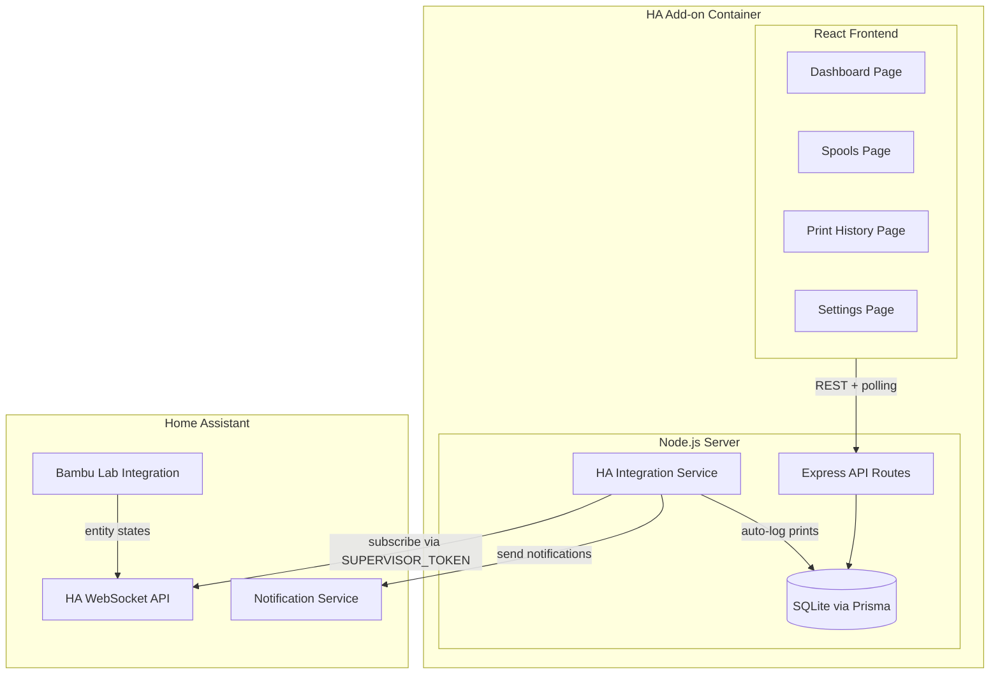

# HA Filament SpoolTracker - Build Plan

## Architecture Overview

---

## Phase 0: Boilerplate Rename

Follow `[.cursor/rules/start-new-project.mdc](start-new-project.mdc)` checklist:

- **Project name**: `HA Filament SpoolTracker`
- **Slug**: `ha_filament_spooltracker`
- **npm name**: `ha-filament-spooltracker` (root `package.json`, Docker image tag)
- **npm scope**: keep `@ha-addon` (used across all `package.json`, imports, tsconfig)
- **Panel icon**: `mdi:printer-3d-nozzle`
- **Panel title**: `SpoolTracker`

Find-and-replace per the checklist:

| Find                                | Replace                    |
| ----------------------------------- | -------------------------- |
| `ha-addon-boilerplate`              | `ha-filament-spooltracker` |
| `ha_addon_boilerplate`              | `ha_filament_spooltracker` |
| `HA Add-on Boilerplate`             | `HA Filament SpoolTracker` |
| `Home Assistant Add-on Boilerplate` | `HA Filament SpoolTracker` |

Update `config.yaml`: description, `panel_icon`, `panel_title`, and add config options for `bambu_entity_prefix` (optional, for manual entity config).

---

## Phase 1: Database Schema

Update `[server/prisma/schema.prisma](server/prisma/schema.prisma)` with models:

- **Printer** -- registered Bambu Lab printers (multi-printer support)
  - `id`, `name`, `haDeviceId` (unique), `entityPrefix` (e.g. `sensor.p1s_01p00a`), `model` (X1C/P1S/A1/etc.), `isActive`, timestamps
- **Spool** -- filament spools with weight tracking
  - `id`, `name`, `filamentType` (PLA/PETG/TPU/ABS/etc.), `color`, `colorHex`, `manufacturer`, `initialWeight`, `remainingWeight`, `spoolWeight`, `diameter` (default 1.75), `isActive` (currently loaded), `isArchived`, `expirationDate`, `purchaseDate`, `notes`, timestamps
- **PrintJob** -- print jobs (auto-created from HA or manual)
  - `id`, `printerId` (FK Printer), `spoolId` (FK Spool), `projectName`, `projectImage` (base64/URL from cover image entity), `filamentUsed` (grams), `status` (in_progress/completed/failed/cancelled), `startedAt`, `completedAt`, `progress`, `notes`, timestamps
- Keep existing **Setting** model for app preferences (low filament threshold, notification settings).

Filament usage is tracked through `PrintJob.filamentUsed` (for prints) and direct updates to `Spool.remainingWeight` (for manual deductions). No separate audit log table needed.

---

## Phase 2: Server - API Routes

Add route files under `[server/routes/](server/routes/)`:

- `**spools.ts`** -- `GET /api/spools`, `POST /api/spools`, `PUT /api/spools/:id`, `DELETE /api/spools/:id`, `POST /api/spools/:id/deduct` (manual deduction), `POST /api/spools/:id/archive`, `POST /api/spools/:id/activate` (mark as currently used)
- `**printJobs.ts`** -- `GET /api/print-jobs` (with filters: printer, spool, status, date range), `GET /api/print-jobs/:id`, `PUT /api/print-jobs/:id` (update status/notes), `DELETE /api/print-jobs/:id`
- `**printers.ts`** -- `GET /api/printers`, `POST /api/printers`, `PUT /api/printers/:id`, `DELETE /api/printers/:id`
- `**dashboard.ts`** -- `GET /api/dashboard/stats` (total stock, active spools, active prints, low filament alerts, recent activity)
- `**ha.ts`** -- `GET /api/ha/entities` (discover Bambu Lab entities from HA), `GET /api/ha/status` (HA connection status)
- `**settings.ts`** -- `GET /api/settings`, `PUT /api/settings` (notification thresholds, preferences)

Register all in `[server/routes/index.ts](server/routes/index.ts)`.

---

## Phase 3: Server - HA Integration Service

Create `server/services/haIntegration.ts`:

1. **Connect to HA** via `ws://supervisor/core/websocket` using `SUPERVISOR_TOKEN` env var (available because `homeassistant_api: true` in config.yaml)
2. **Auto-discover Bambu printers**: Call `config/entity_registry/list` to find entities matching Bambu Lab integration (`bambu_lab` manufacturer/integration domain), group by device
3. **Subscribe to entity state changes** for discovered printer entities: `Print Status`, `Print Weight`, `Cover Image`, `Current Stage`, `Active Tray` (AMS), tray attributes
4. **Print lifecycle detection**:
  - When `Print Status` transitions to a printing state -> create a `PrintJob` record, capture `projectName` from task/subtask entity, `projectImage` from cover image entity, `filamentUsed` from print weight entity
  - When `Print Status` transitions to idle/complete -> update `PrintJob` status to `completed`, deduct `filamentUsed` from the associated `Spool`, create `FilamentDeduction` record
  - When `Print Status` shows failure -> update to `failed`, optionally deduct partial filament
5. **Spool matching**: Match AMS tray or external spool to a registered `Spool` by color, type, or user-assigned mapping

Relevant Bambu Lab HA entities (from [entity docs](https://docs.page/greghesp/ha-bambulab/entities)):

- Print status, Current Stage, Print Progress
- Print Weight, Print Length
- Cover Image (thumbnail)
- Start Time, End Time, Remaining Time
- AMS tray attributes (Color, Name, Type, Remaining Filament, Spool serial number)
- External Spool attributes
- Print Error

---

## Phase 4: Server - Notifications

Create `server/services/notifications.ts`:

- Use HA REST API (`http://supervisor/core/api/services/notify/persistent_notification`) or `notify.notify` service to send notifications
- Trigger notifications for:
  - **Low filament**: When spool `remainingWeight` drops below threshold (stored in Settings)
  - **Unassigned print job**: When a completed print job has no spool assigned (auto-matching failed), prompting the user to manually assign it
  - **Spool expiration**: When a spool's `expirationDate` is approaching (check periodically)
- Configurable thresholds stored in `Setting` model

---

## Phase 5: Frontend - Navigation & Layout

- Install no router library -- use simple state-based tab navigation (consistent with boilerplate pattern)
- Update `[client/src/App.tsx](client/src/App.tsx)` to add tab bar with 4 tabs: **Dashboard**, **Spools**, **Print History**, **Settings**
- Use `useStoredState` hook to persist the active tab across page refreshes
- Create page directories:
  - `client/src/pages/Dashboard/` (already exists, repurpose)
  - `client/src/pages/Spools/`
  - `client/src/pages/PrintHistory/`
  - `client/src/pages/Settings/`

---

## Phase 6: Frontend - Spools Page

`client/src/pages/Spools/index.tsx`:

- **Spool grid**: Responsive card grid showing each spool with color indicator, type badge, weight progress bar (remaining/initial), active status
- **Add Spool button**: Opens modal with form (name, filament type dropdown, color picker, weight, manufacturer, dates)
- **Spool card actions**: Edit, Deduct Filament (modal with amount + reason), Archive, Delete (with confirmation)
- **Filters/tabs**: All / Active / Archived
- **Empty state**: Friendly message + CTA to add first spool

Create modals in `client/src/modals/`:

- `AddEditSpoolModal.tsx`
- `DeductFilamentModal.tsx`
- `ConfirmModal.tsx` (reusable delete/archive confirmation)

---

## Phase 7: Frontend - Print History Page

`client/src/pages/PrintHistory/index.tsx`:

- **Print job list**: Table or card list with columns: thumbnail, project name, printer, spool (color dot + name), filament used, status badge, date/time
- **Status badges**: color-coded (green=completed, blue=in_progress, red=failed, gray=cancelled)
- **Filters**: By printer, spool, status, date range
- **Empty state**: "No prints recorded yet" with explanation of auto-logging

---

## Phase 8: Frontend - Dashboard Page (deafult view)

Repurpose `[client/src/pages/Dashboard/index.tsx](client/src/pages/Dashboard/index.tsx)`:

- **Summary cards**: Total spools, Total filament stock (kg), Active prints count, Low filament alerts count
- **Active prints section**: Cards showing current prints with progress bar, project image, printer name, spool, ETA (auto-refreshed via polling)
- **Low filament warnings**: List of spools below threshold
- **Recent activity**: Last 5-10 print jobs with quick status

---

## Phase 9: Frontend - Settings Page

`client/src/pages/Settings/index.tsx`:

- **Printers section**: Discovered Bambu printers from HA with ability to enable/disable, edit entity prefix, rename
- **Notification settings**: Low filament threshold (grams), enable/disable notification types
- **Spool-AMS mapping**: UI to link registered spools to specific AMS tray slots or external spool (for auto-matching during prints)
- **HA connection status**: Show connection state to HA Supervisor API

---

## Phase 10: Shared Types

Update `[types/index.ts](types/index.ts)` with interfaces for all data models and API request/response types:

- `Spool`, `PrintJob`, `Printer`, `DashboardStats`
- `SpoolCreateRequest`, `SpoolUpdateRequest`, `DeductionRequest`

---

## Phase 11: Remove WebSocket Boilerplate

Strip out the WS code that shipped with the boilerplate (not needed for this project):

- Delete `server/websocket/WebSocketManager.ts` and its import/setup in `server/index.ts`
- Delete `client/src/hooks/useWebSocket.tsx` and remove the `WebSocketProvider` wrapper from `App.tsx`
- Remove `ws` dependency from `server/package.json`
- Remove WS-related types from `types/index.ts`
- Remove connection status indicator from the header (replace with simpler server health check if desired)

---

## Key Files to Create/Modify

| File                                        | Action                            |
| ------------------------------------------- | --------------------------------- |
| `config.yaml`                               | Modify (rename, add options)      |
| `server/prisma/schema.prisma`               | Modify (add models)               |
| `server/routes/spools.ts`                   | Create                            |
| `server/routes/printJobs.ts`                | Create                            |
| `server/routes/printers.ts`                 | Create                            |
| `server/routes/dashboard.ts`                | Create                            |
| `server/routes/ha.ts`                       | Create                            |
| `server/routes/settings.ts`                 | Create                            |
| `server/routes/index.ts`                    | Modify (register routes)          |
| `server/services/haIntegration.ts`          | Create                            |
| `server/services/notifications.ts`          | Create                            |
| `server/index.ts`                           | Modify (remove WS setup)          |
| `server/websocket/WebSocketManager.ts`      | Delete                            |
| `types/index.ts`                            | Modify (add types, remove WS)     |
| `client/src/App.tsx`                        | Modify (tabs, remove WS provider) |
| `client/src/hooks/useWebSocket.tsx`         | Delete                            |
| `client/src/pages/Dashboard/index.tsx`      | Modify (new dashboard)            |
| `client/src/pages/Spools/index.tsx`         | Create                            |
| `client/src/pages/PrintHistory/index.tsx`   | Create                            |
| `client/src/pages/Settings/index.tsx`       | Create                            |
| `client/src/modals/AddEditSpoolModal.tsx`   | Create                            |
| `client/src/modals/DeductFilamentModal.tsx` | Create                            |
| `client/src/modals/ConfirmModal.tsx`        | Create                            |
| `client/src/components/SpoolCard.tsx`       | Create                            |
| `client/src/components/PrintJobCard.tsx`    | Create                            |
| `client/src/components/TabNav.tsx`          | Create                            |
| `client/src/components/StatusBadge.tsx`     | Create                            |
| `client/src/components/ProgressBar.tsx`     | Create                            |
| `client/src/services/api.ts`                | Modify (add API functions)        |

